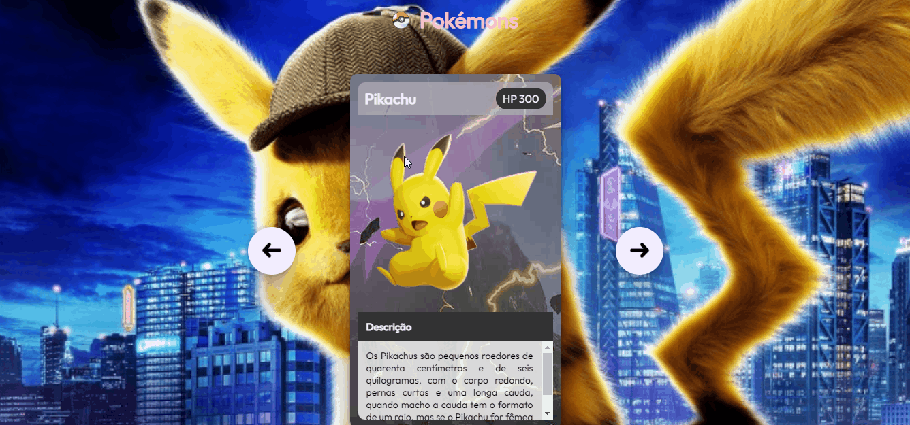

# Projeto - Pokemon
Um projeto que descreve um pouco sobre o desenho do Pokemon, como também buscou demonstrar e descrever três personagens diferentes tanto quanto suas habilidades e características. 🚀❤🙌

[]

# Personagens 😁😎🐲
Aqui foram listados os três persnagens importantes para a elaboração deste projeto. 

## Pikachu
Os Pikachus são pequenos roedores de quarenta centímetros e de seis quilogramas, com o corpo redondo, pernas curtas e uma longa cauda, quando macho a cauda tem o formato de um raio, mas se o Pikachu for fêmea sua cauda ganha um coração na ponta.

## Charizard
Geralmente, um Charizard é competitivo. Ele adora batalha e seu espírito competitivo também é notável, uma vez que nunca vai cuspir fogo em um inimigo mais fraco a menos que provocado ou ordenado. Quando fica muito irritado, as chamas em sua cauda se tornam branco-azulados.

## Mewtow
Mewtow foi criado geneticamente em um laboratório, sendo um clone do misterioso antigo Pokémon Mew. É uma criatura com postura humanóide, mas tem algumas características felinas.

## Tecnologias utilizadas 🚀
- HTML5
- CSS3
- JAVASCRIPT
- PHOTOSHOP

## Por que desenvolvi o projeto ?
Este trabalho foi desenvolvido com intuito de demonstrar minhas habilidades com a programação por meio da elaboração dos personagens que fazem parte do desenho. O projeto foi idealizado por mim, permitindo livre expressão e desenvolvimento dos códigos expostos dentro cards com recursos de descrição inerente a cada um deles, podendo passar e voltar através de setas estrategicamente colocadas. Espero que gostem e me ajude compartilhando !!!

Feito com ❤ por Fabiano Dias Moreira 👏 [Veja meu linkedIn](https://www.linkedin.com/in/fabiano-dias-moreira-b851b7217/)

